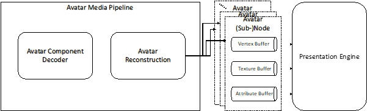

# 	Avatar

## Contributors

* ISO/IEC SC29 WG3 (MPEG Systems) - Scene Description Breakout Group
* Contacts
  * Thomas Stockhammer (MPEG-I Scene Description BoG Chair, tsto@qti.qualcomm.com)

## Status

Based on [ISO/IEC DIS 23090-14 2nd Edition](https://www.iso.org/standard/80900.html)

## Dependencies

Written against the glTF 2.0 spec.

##  Overview

Signaling an avatar at a node level is achieved by the definition of the MPEG_node_avatar extension.
Depending on the input components and the offline model, the proper avatar reconstruction and animation needs to be instantiated to generate the final dynamic/animated 3D mesh of the avatar. 
When considering describing a user’s avatar in scene description, the following requirements are derived:
* The avatar may be reconstructed/animated from a wide range of Avatar representations,
* The reconstructed/animated avatar representation abides by the supported primitives in scene description,
* It is possible to associate interactivity triggers with different parts/segments of the user avatar (e.g. hand or finger) using the node interactivity triggers.

To address these requirements, the avatar reconstruction/animation is assumed to be independent of the avatar rendering. This design aligns with the principles and architecture of this specification. Irrespective of the chosen avatar representation format, the Presentation Engine is then only required to render the reconstructed avatar in one of the supported 3D formats, such as a dynamic mesh. The figure below depicts the pipeline that addresses the requirements of a user’s avatar in the scene description.

<figure>

<figcaption><em>Avatar media pipeline.</em></figcaption>
</figure>

The MPEG_node_avatar extension shall be included as an extension to a node object. All referenced mesh elements by this node will be reconstructed from an avatar representation.
## 	Semantics

The application identifies the avatar format and reconstruction method based on the type of the MPEG_node_avatar extension. The default type is defined in Annex H of this specification.

Table 1: Description of MPEG_node_avatar extension 
| Name | Type | Required | Default | Description |
|--|--|--|--|--|
| type | string | &#10003; Yes|  | The type of the avatar representation is provided as a URN that uniquely identified the avatar representation scheme. The avatar representation scheme defines the format of all components that are used to reconstruct and animate the avatar. The reference MPEG avatar URN is defined [here](#mpeg-reference-avatar) |
| mappings | array(Mapping) | &#10003; Yes|  | The mapping between child nodes and their associated avatar path. Note that the corresponding path for a parent node shall be a prefix of the path of its child nodes. |

The Mapping object is defined as follows:

Table 2: Description of Mapping object
| Name | Type | Required | Default | Description |
|--|--|--|--|--|
| path | string | &#10003; Yes|  | Provides the Avatar path for this node as described [here](#avatar-path-definition) |
| node | integer | &#10003; Yes|  | The index of the child node of the mesh part that corresponds to the label in the path. |

## 	MPEG reference avatar

The MPEG reference avatar is identified by “urn:mpeg:sd:2023:avatar” as avatar type. The reference avatar framework builds on the reference avatar as defined in Annex H.

## 	Avatar path definition

The avatar path allows the addressing of every segment in an avatar, which allows for associating them with interactivity triggers and skeleton animations. An example structure of the humanoid Avatar is depicted in Table 3 and the Avatar path is constructed by concatenating the Avatar parts hierarchically from root to the desired element using “/” as separator e.g.  “/full_body/upper_body/arm_right/hand_right”. 

Table 3: Avatar paths
| "full_body": { 	"upper_body":{ 		"head":{ 			"face":{ 				"mouth", 				"lower_jaw", 				"upper_jaw", 				"eye_right", 				"eye_left" 			}, 			"neck", 			"ear_right", 			"ear_left", 			"back" 		}, 		"thorax":{ 			"chest_front", 			"chest_back", 			"shoulder_front_right", 			"shoulder_front_left", 			"shoulder_back_right", 			"shoulder_back_left" 		}, 		"arm_right":{ 			"upper_arm_right", 			"lower_arm_right", 			"hand_right":{ 				"thumb_proximal_right":{ 					"thumb_intermediate_right":{ 						"thumb_distal_right" 						} 				}, 				"index_proximal_right":{ 					"index_intermediate_right":{ 						"index_distal_right":{ 							"index_top_right" 						} 					} 				}, 				"middle_proximal_right":{ 					"middle_intermediate_right":{ 						"middle_distal_right":{ 							"middle_top_right" 						} 					} 				}, 				"ring_proximal_right":{ 					"ring_intermediate_right":{ 						"ring_distal_right":{ 							"ring_top_right" 						} 					} 				}, 				"litttle_proximal_right":{ 					"litttle_intermediate_right":{ 						"litttle_distal_right":{ 							"litttle_top_right" 						} 					} 				} 			} 		}, 		"arm_left":{ 			"upper_arm_left", 			"lower_arm_left", 			"hand_left":{ 				"thumb_proximal_left":{ 					"thumb_intermediate_left":{ 						"thumb_distal_left" 						} 				}, 				"index_proximal_left":{ 					"index_intermediate_left":{ 						"index_distal_left":{ 							"index_top_left" 						} 					} 				}, 				"middle_proximal_left":{ 					"middle_intermediate_left":{ 						"middle_distal_left":{ 							"middle_top_left" 						} 					} 				}, 				"ring_proximal_left":{ 					"ring_intermediate_left":{ 						"ring_distal_left":{ 							"ring_top_left" 						} 					} 				}, 				"litttle_proximal_left":{ 					"litttle_intermediate_left":{ 						"litttle_distal_left":{ 							"litttle_top_left" 						} 					} 				} 			} 		} 	} 	"lower_body":{ 		"pelvis":{ 			"pelvis_front":{ 				"pelvis_front_right", 				"pelvis_front_left" 			}, 			"pelvis_back":{ 				"pelvis_back_right", 				"pelvis_back_left" 			} 		}, 		"leg_right":{ 			"upper_leg_right", 			"lower_leg_right", 			"foot_right":{ 				"toes_right" 			} 		}, 		"leg_left":{ 			"upper_leg_left", 			"lower_leg_left", 			"foot_left":{ 				"toes_left" 			} 		} 	} } |
|:-|

## 	Processing model

Each avatar in a scene is represented by a node that contains the MPEG_node_avatar extension. When present in a node, it means that all referenced mesh elements by this node will be reconstructed from an avatar representation. 

## Schema

* **JSON schema**: [MPEG_node_avatar.schema.json](./schema/MPEG_node_avatar.schema.json)

## Known Implementations

* [ISO/IEC WD 23090-24](https://www.iso.org/standard/83696.html)

## Resources

* [ISO/IEC FDIS 23090-14](https://www.iso.org/standard/80900.html), Information technology — Coded representation of immersive media — Part 14: Scene Description 
* [ISO/IEC WD 23090-24](https://www.iso.org/standard/83696.html), Information technology — Coded representation of immersive media — Part 24: Conformance and Reference Software for Scene Description for MPEG Media

## License

Copyright ISO/IEC 2022

The use of the "MPEG scene description extensions" is subject to the license as accessible here: https://standards.iso.org/ and is subject to the IPR policy as accessible here: https://www.iso.org/iso-standards-and-patents.html.

