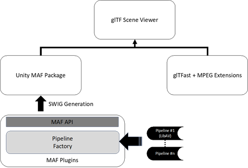

# XR Services in 5G-MAG
5G-MAG is implementing a software platform for XR media services over 5G. The details of the projects can be found at [XR-services in 5G-MAG](https://5g-mag.github.io/Getting-Started/pages/xr-media-integration-in-5g/).

## Introduction
[5G-MAG](https://www.5g-mag.com/about) has adopted several open source libraries to support 3D and XR services in 3GPP based on the MPEG-I Scene Description (SD) as defined on the specification in [ISO/IEC 23090-14](https://www.iso.org/standard/80900.html). The initially available libraries are closely aligned with the work in Rel-18 3GPP SA4 namely:
*	MeCAR: [TS 26.119](https://www.3gpp.org/ftp/Specs/archive/26_series/26.119/26119-i00.zip) is aimed at defining the media capabilities for AR devices (addressing various types of form factors) when connected to the 3GPP networks. Working assumptions connect the AR media processing to an XR runtime for which OpenXR is used as a reference API, i.e. ensuring at least compatibility with OpenXR and supporting MPEG-I Scene Description, with optionally using V3C (ISO/IEC 23090-5),as an end point.
*	Split Rendering MSE: [TS 26.565](https://www.3gpp.org/ftp/Specs/archive/26_series/26.565/26565-120.zip) is aimed to support split rendering workflows and is based on TS 26.119 
*	PROMISE: 5G-Advanced media profiles for messaging services creates a new specification in [TS 26.143](https://www.3gpp.org/ftp/Specs/archive/26_series/26.143/26143-i00.zip) in order to address, among others, 3D Message Formats.

In addition, in order to make these technologies accessible to a broader community, several aspects are missing and are preferably developed in 5G-MAG.
*	An explainer of XR activities in 3GPP addressing the ongoing and completed 3GPP Rel-18 work.
*	**Implementation Guidelines** to implement use cases based on the defined technologies
*	Usability and documentation of the XR open source project is still in its infancy, an improved documentation is needed.
*	Enable and simplify such that third-party developers including academia, other MPEG contributors and the general industry can participate in the project. This includes a coverage map of what is implemented from ISO/IEC 23090-14 functions (including functionalities defined Amd.1 and Amd.2) and those that are missing
*	Very preliminary test content is available showing only a small subset of the features. Improvement to test content development, documentation and generation are needed.
*	An important aspect for portability is the availability of a web-based player. The integration of the player, as well as documentation and further enhancement is an important aspect. 
*	5G-MAG has several projects related to 5G delivery including 5G Media Streaming, but no integration of XR-related source formats. To provide a consistent story as well as to support future demos, a combination of MPEG-I Scene Description with 5G Media Streaming, including the integration of DASH delivery is important. Secondly, XR is heavily used in the context of real-time communication and the extension of the 5G-MAG reference tools with the Real-Time Communication capabilities based on WebRTC is an important aspect. Contributions on these two aspects would be welcome.

## XR projects in 5G-MAG
The following libraries had been contributed towards the XR projects in 5G-MAG.
*	The main deliverable is a [Unity project](https://github.com/5G-MAG/rt-xr-unity-player) to load an MPEG-I Scene Description document and render it. 
*	A [native implementation](https://github.com/5G-MAG/rt-xr-maf-native) of the Media Access Functions API as defined in ISO/IEC 23090-14. 
*	Media Access Function API [Unity3D package](https://github.com/5G-MAG/rt-xr-maf-plugin) 
*	A fork of the [glTFast project with modifications](https://github.com/5G-MAG/rt-xr-gITFast) to parse the MPEG-I scene description glTF extension 
*	An initial set of MPEG-I Scene Description [assets](https://github.com/5G-MAG/rt-xr-content)
*	An initial support for extensions to [blender](https://github.com/5G-MAG/rt-xr-blender-exporter) to generate 3D assets 
NOTE: To access the repos, please check here: https://www.5g-mag.com/early-access

The player allows users to load MPEG-I SD scene documents at runtime and in the editor. Among other immersive experiences, runtime loading allows app and service developers to create shared 6DoF spaces, where the scene of the shared environment is composed in the network and loaded by all participants at runtime.
The implementation follows the MPEG-I SD architecture and its modular design. A high level architecture is depicted in Figure 1.

Currently the implementation covers the following features:
*	MPEG-I scene description architecture with separation of MAF and Presentation Engine as described in ISO/IEC 23090-14. The implementation covers the MAF and Buffer APIs as defined by the standard.
*	Support for parsing and rendering of the following  glTF extensions: MPEG_media, MPEG_accessor_timed, MPEG_buffer_circular as defined by ISO/IEC 23090-14. A few additional extensions are expected soon.
*	Implementation of the video textures and spatial audio extension parsing. Decoding is performed through the [Libav library](https://github.com/libav/libav), and rendering is performed through Unity graphics and spatial audio rendering.
*	Implemented support for VR rendering through the [Unity OpenXR plugin](https://docs.unity3d.com/Packages/com.unity.xr.openxr@1.2/manual/index.html)
* New feature support for MPEG_Anchor extension has been submited to 5G-MAG gltFast repository, Unity player.

The repositories are currently private and have not yet been published.
